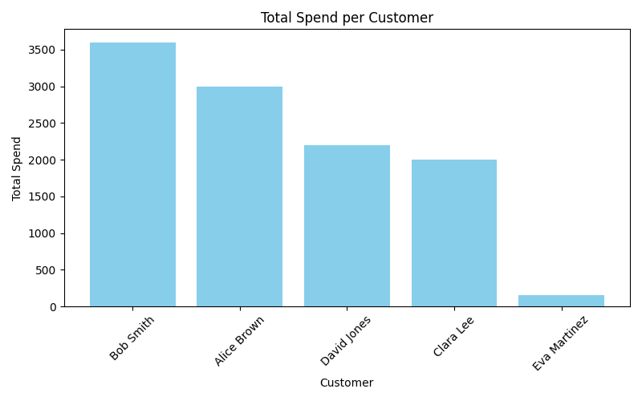
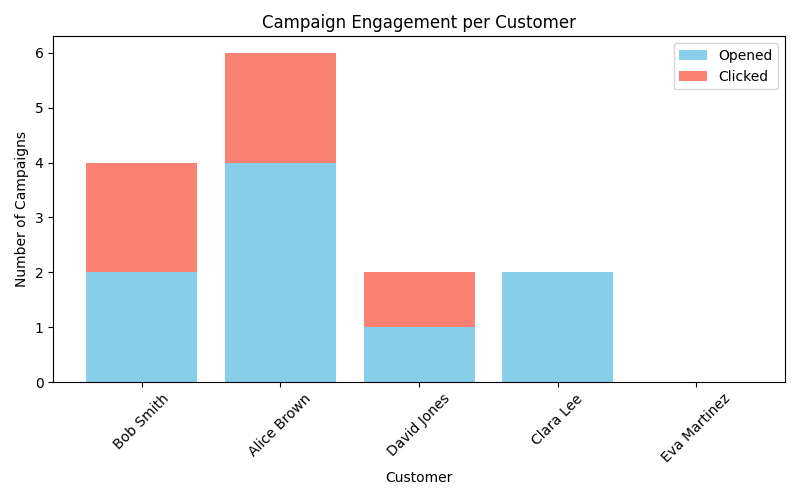
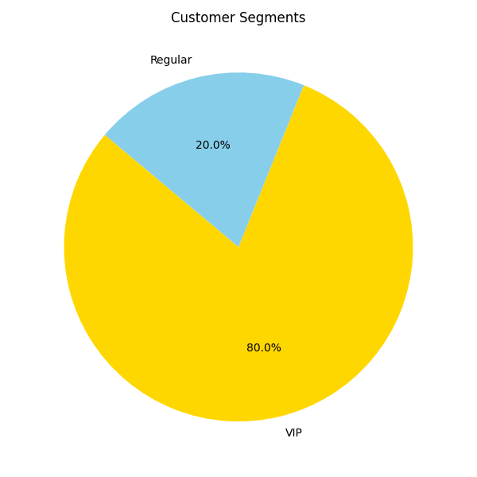

# CRM Customer Insights Project

A SQL and Python project demonstrating CRM analytics workflows. This project simulates customer transactions, campaign engagement, and segmentation, generating actionable insights through analysis and visualisation.

---

## Project Overview

- Simulated customer dataset with transactions and campaign engagement.  
- Built relational tables: `customers`, `transactions`, `campaigns`.  
- Goal: practice SQL database management, Python analysis, and visualisation for CRM insights.  

---

## Workflow

1. **Database Creation**
   - SQLite database created with relational tables.  
   - Verified data integrity in DBeaver.  

2. **Data Analysis with Python**
   - Connected to SQLite using `sqlite3` and `pandas`.
   - Calculated key metrics: total spend, campaign engagement, and customer segments.

3. **Visualisations**
   - Total spend per customer (bar chart)  
   - Campaigns opened vs clicked (stacked bar chart)  
   - Customer segments (pie chart)  
   - Charts saved as `.png` files


# Example: Reading customers table with pandas
```python
import sqlite3
import pandas as pd

conn = sqlite3.connect('crm_customer_insights')
df_customers = pd.read_sql_query("SELECT * FROM customers;", conn)
```

## Key Learnings

- Structured a relational database with multiple tables.
- Practiced SQL operations: `CREATE`, `INSERT`, `SELECT`, `UPDATE`.
- Connected Python to SQLite for analysis using Pandas.
- Calculated derived metrics (total spend, engagement rates).
- Visualised data with Matplotlib: bar charts, stacked bars, and pie charts.
- Developed an end-to-end workflow suitable for a CRM analytics portfolio.

---

## Tools Used

- **SQLite** – database engine
- **DBeaver** – database management and query verification
- **Python, Pandas, Matplotlib** – data analysis and visualisation
- **VS Code** – scripting and project organization
- **GitHub** – version control and portfolio hosting

---

## Dataset

- Synthetic customer dataset for practice purposes.
- Includes: customer names, total spend, campaigns opened/clicked, and customer segment.
- Fully anonymised and safe for public use.

---

## Visualisations

### Total Spend per Customer


### Campaign Engagement (Opened vs Clicked)


### Customer Segments


